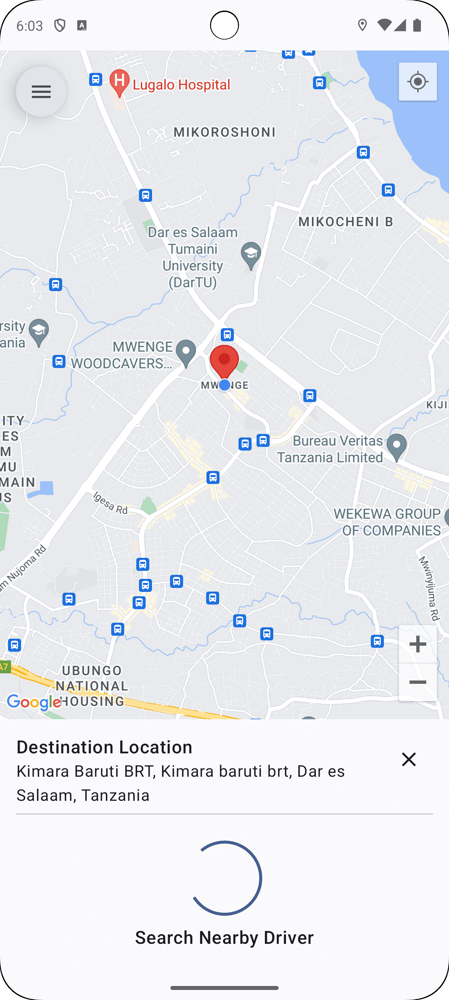

<p align="center">
  <a href="https://opensource.org/licenses/Apache-2.0"></a>
  <a href="https://android-arsenal.com/api?level=21"></a>
  <a href="https://getstream.io"></a>
</p>

# 🚗 Bolt Clone App

Welcome to the unofficial Bolt clone app! This project is an early-stage clone of the Bolt app, showcasing modern Android development tools and libraries.

## Status: 🚧 Active Development 🚧

## Features

- **Kotlin**: Modern, expressive programming language.
- **Jetpack Compose**: Declarative UI toolkit.
- **Firebase Auth**: Secure authentication.
- **Stream IO**: Real-time messaging.
- **Google Maps**: Interactive maps.
- **Google Places**: Location search and details.
- **Material3**: Latest Material Design components.
- **Firestore**: Scalable NoSQL database.
- **Coroutines**: Simplified concurrency.

## 📷 Previews
### Driver

<p align="center">


</p>

### Passenger

<p align="center">





</p>

## Installation

1. **Clone the repo**
   ```sh
   git clone https://github.com/mtali/bolt.git
   cd bolt
   ```
2. **Open in Android Studio and sync the project**
3. **For Firebase configuration, follow [this link](https://firebase.google.com/docs/android/setup)**
4. **Be sure to generate and set the SHA-1**
   ```sh
   ./gradlew signingReport
   ```
5. **Enable the Email/Password sign-in provider** (as shown below)

   
6. **Configure Stream**
   
   Create new project on [getstream](https://getstream.io/dashboard/) and make sure under roles and permission 'user' can update his/her own role

7. **Auth Keys**

   At the root of the project, create a file named `secrets.properties` and add the map and stream API keys. You can find an example in `secrets.defaults.properties`.
   
9. **Run the project**

## License

Distributed under the MIT License. See `LICENSE` for more info.

## Acknowledgements

- [Kotlin](https://kotlinlang.org/)
- [Jetpack Compose](https://developer.android.com/jetpack/compose)
- [Firebase](https://firebase.google.com/)
- [Stream IO](https://getstream.io/)
- [Google Maps](https://developers.google.com/maps)
- [Google Places](https://developers.google.com/places)
- [Material Design](https://material.io/)
- [Firestore](https://firebase.google.com/docs/firestore)

## Contact

Emmanuel S Mtali - [@emmanuel_mtali](https://twitter.com/emmanuel_mtali) - emmanuel.mtali@protonmail.com

Project Link: [https://github.com/mtali/bolt](https://github.com/mtali/bolt)

⭐️ If you find this project useful! 🚀

---

Happy coding! 🎉
